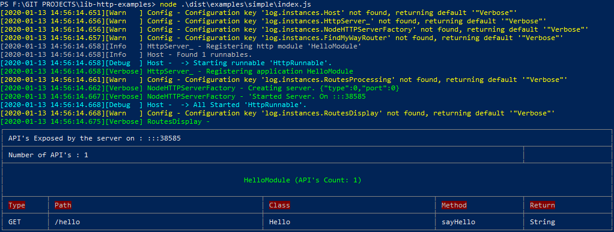
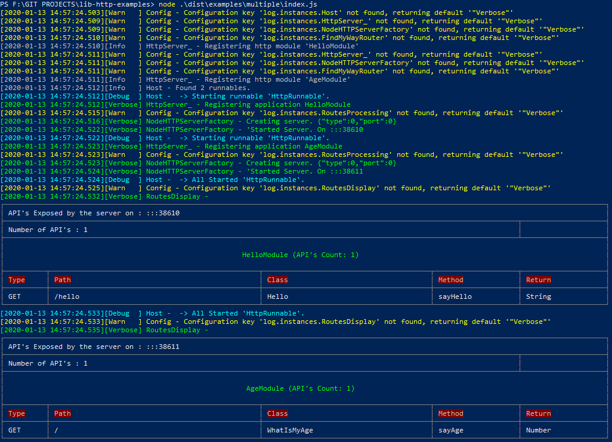
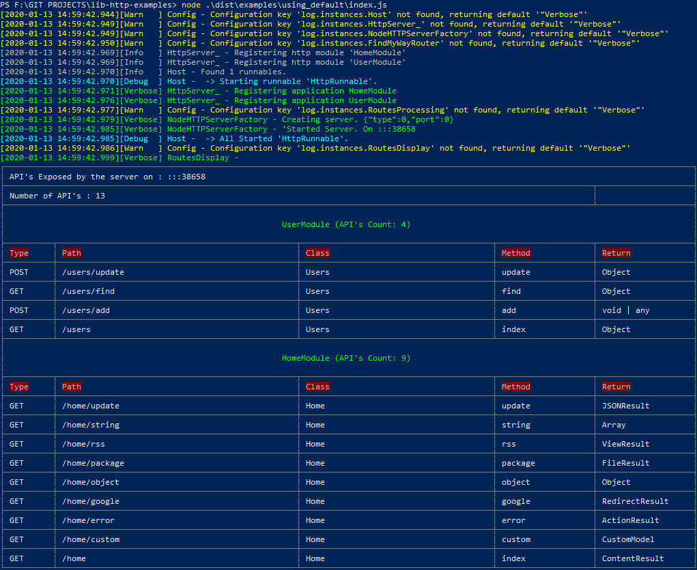
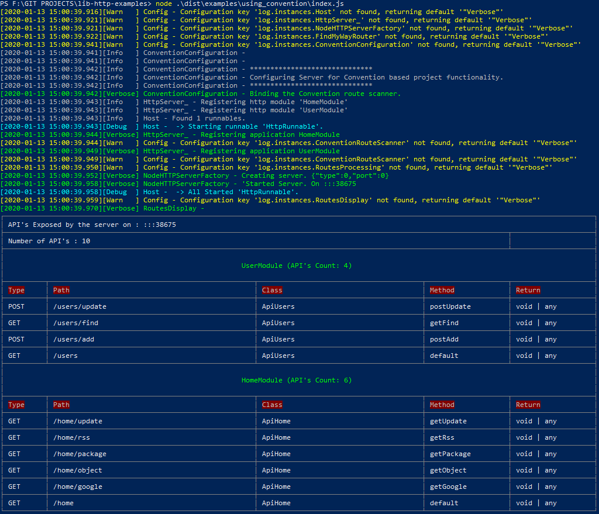
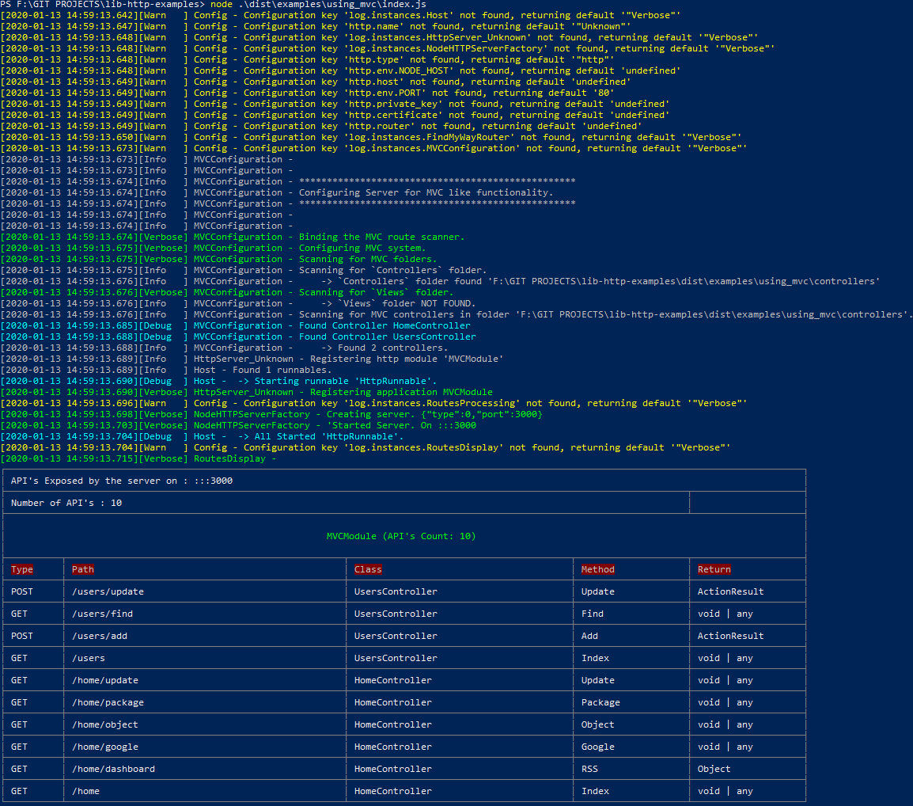

# lib-http-examples

Example projects for showing functionalities of the [lib-http](https://github.com/MRazvan/lib-http) project.

For the view render it is using [ejs](https://github.com/mde/ejs)

- [lib-http-examples](#lib-http-examples)
  - [Installation](#installation)
  - [Examples](#examples)
      - [Simple](#simple)
      - [Multiple servers](#multiple-servers)
      - [Models](#models)
      - [Default routes](#default-routes)
      - [Default functionality](#default-functionality)
      - [Convention based project](#convention-based-project)
      - [.NET MVC like project](#net-mvc-like-project)
  - [Important](#important)

## Installation
```
git clone https://github.com/MRazvan/lib-http-examples.git

cd lib-http-examples
npm i 
npm run build
```

## Examples
#### Simple

The simplest example showing how to create an API with the defaults provided by [lib-http](https://github.com/MRazvan/lib-http)

```
node dist/examples/simple/index.js
```


#### Multiple servers

Another simple example showing multiple http servers

```
node dist/examples/multiple/index.js
```


#### Models

An example showing how to create a more complex interceptor / system for sending arguments to the target method. And possibly validating those models.

```
node dist/examples/models/index.js
```

#### Default routes

An example showing how to handle routes not bound by us. For example serving static files.

```
node dist/examples/default_routes/index.js
```

#### Default functionality

An example showing some of the default functionalities exposed by the [lib-http](https://github.com/MRazvan/lib-http) library.

```
node dist/examples/using_default/index.js
```



#### Convention based project

An example showing how to change the route scanner to generate routes based on a project's convention.
1. All api's start with 'Api'
2. All methods start with the http method (get|put|post)<methodName>
3. All arguments start with the place of origin (q_|p_|b_) for query, param, body.
```typescript
class ApiHome{
  public getHello(q_name: string): string {}
}
```
<br/>
<br/>

```
node dist/examples/using_convention/index.js
```



#### .NET MVC like project

An example showing how to change the HTTP server so that the project starts to looks like .NET MVC.

Loads all controllers from the 'controllers' folder.

The view path is 'views/controller/action'. Example: views/home/index.ejs

All methods are 'GET' by default.

All arguments are retrieved in the following order, the key is the name of the argument.
- from query
- from route param
- from body
  
> POST /user/update?name=Test same as
> 
> POST /user/update  - body { name: 'Test' }
If we have an 'Index' method, that will be the default handler for the controller.


```typescript
class HomeController{
  public Index(name: string): string {}
}
```
<br/>
<br/>

```
node dist/examples/using_mvc/index.js
```



## Important
Even if we change the way we host our API's it does not mean that the attributes exported by [lib-http](https://github.com/MRazvan/lib-http) do not work.
They continue to work even if we change how we generate our routes.
```typescript
class HomeController{
  // This continues to work if we make the MVC interceptor smart so it does not overwrite what the lib-http does
  //    Meaning check first that the argument was not already set
  public Index(@Query('name') name: string): string {}
}
```
